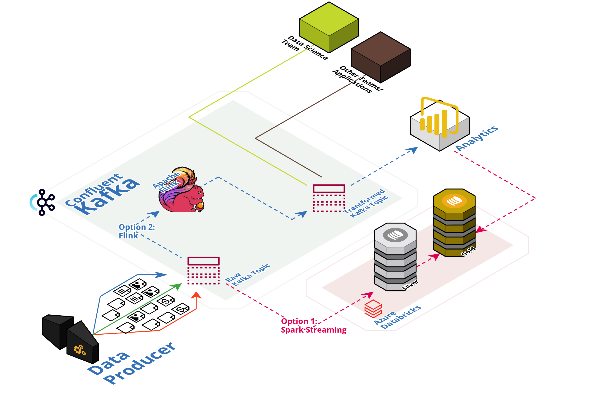

# Elevating Analytics with Real-Time Data Streaming: A Deep Dive into Kafka


Welcome to our repository, crafted to highlight the seamless integration and ease of use of Kafka. Dive into:

1. Set up Confluent Cloud, Connectors & Flink.
2. Set up Confluent Kafka Platform Locally


## Created by

This repo has been created by:
|#|Name|Contact|
|----|---|---|
|1|Sami Alashabi|[](https://www.linkedin.com/in/sami-alashabi)|
|2|Maria Berinde-Tampanariu|[](https://www.linkedin.com/in/maria-berinde-tampanariu)|


## Design
[](https://app.cloudcraft.co/view/a1e84540-b924-4a33-b1c9-f8044601c945?key=3m40jn0enpfd2t90&interactive=true&embed=true)


## Slides
[](https://docs.google.com/presentation/d/1lTWvNwJgJphgH6YUYEL9AiE-nlDidsqMNJF_MiJryl4/edit?exids=71471483,71471477&pli=1#slide=id.g1ea5efd3fa5_0_3148)


## Installation


## Usage


    ```md
    
    ```

