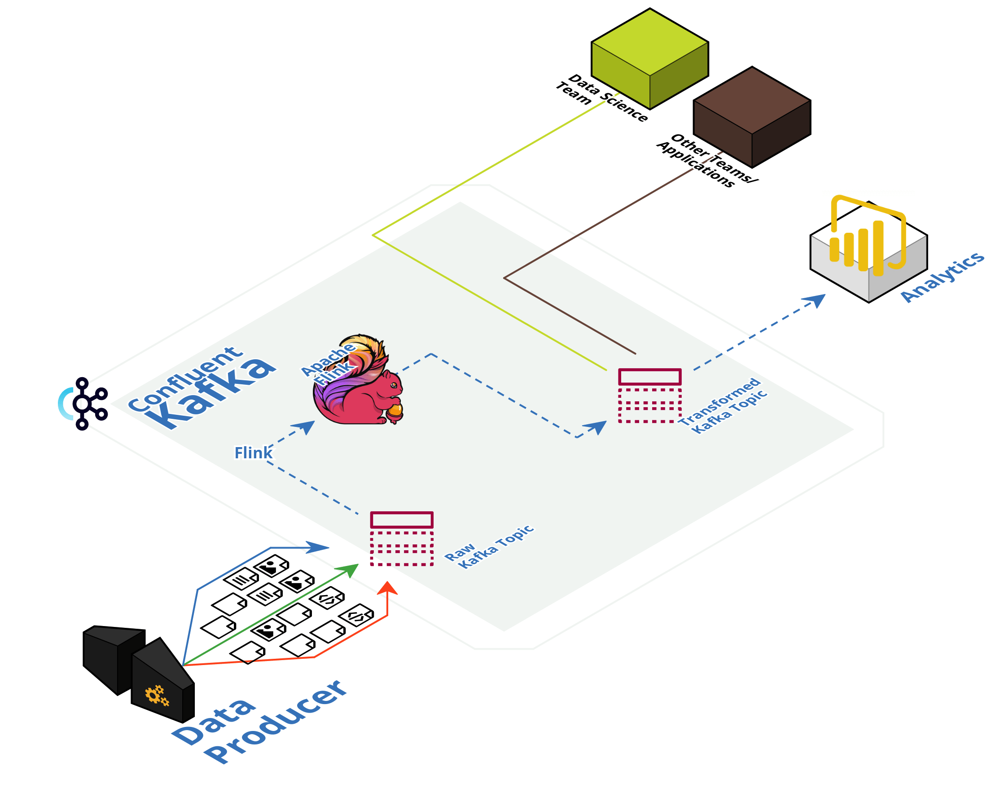

# Elevating Analytics with Real-Time Data Streaming: A Deep Dive into Kafka


Welcome to our repository, crafted to highlight the seamless integration and ease of use of Kafka. Dive into:

1. Set up Confluent Cloud, Connectors & Flink.
2. Set up Confluent Kafka Platform Locally


## Created by

This repo has been created by:
|#|Name|Contact|
|----|---|---|
|1|Sami Alashabi|[](https://www.linkedin.com/in/sami-alashabi)|
|2|Maria Berinde-Tampanariu|[](https://www.linkedin.com/in/maria-berinde-tampanariu)|


## Design
[](https://app.cloudcraft.co/view/a1e84540-b924-4a33-b1c9-f8044601c945?key=3m40jn0enpfd2t90&interactive=true&embed=true)


## Slides
[](https://docs.google.com/presentation/d/1lTWvNwJgJphgH6YUYEL9AiE-nlDidsqMNJF_MiJryl4/edit?exids=71471483,71471477&pli=1#slide=id.g1ea5efd3fa5_0_3148)


# Installation
Installation needs to be do once

## Pre-requisites
- User account on [Confluent Cloud](https://www.confluent.io/confluent-cloud/tryfree)
- Local install of [Terraform](https://www.terraform.io) (details below)
- Local install of [jq](https://jqlang.github.io/jq/download) (details below)

## Install Terraform
```
brew tap hashicorp/tap
brew install hashicorp/tap/terraform
brew update
brew upgrade hashicorp/tap/terraform
```

## Install jq
```
brew install jq
```

# Set up services for the demo

## Set environment variables
- Create file `.env`
```
#!/bin/bash

# Confluent Platform
export CONFLUENT_CLOUD_API_KEY="Enter credentials here"
export CONFLUENT_CLOUD_API_SECRET="Enter credentials here"
```
## Start Demo
- Run command: `./demo_start.sh`


## Stop Demo
- Run command: `./demo_stop.sh`


# Terraform Documentation
## Requirements

| Name | Version |
|------|---------|
| <a name="requirement_confluent"></a> [confluent](#requirement\_confluent) | 1.55.0 |
| <a name="requirement_external"></a> [external](#requirement\_external) | 2.3.1 |

## Providers

| Name | Version |
|------|---------|
| <a name="provider_confluent"></a> [confluent](#provider\_confluent) | 1.55.0 |
| <a name="provider_random"></a> [random](#provider\_random) | 3.5.1 |

## Resources

| Name | Type |
|------|------|
| [confluent_api_key.app_manager_kafka_cluster_key](https://registry.terraform.io/providers/confluentinc/confluent/1.55.0/docs/resources/confluent_api_key) | resource |
| [confluent_api_key.clients_kafka_cluster_key](https://registry.terraform.io/providers/confluentinc/confluent/1.55.0/docs/resources/confluent_api_key) | resource |
| [confluent_api_key.sr_cluster_key](https://registry.terraform.io/providers/confluentinc/confluent/1.55.0/docs/resources/confluent_api_key) | resource |
| [confluent_environment.cc_demo_env](https://registry.terraform.io/providers/confluentinc/confluent/1.55.0/docs/resources/confluent_environment) | resource |
| [confluent_flink_compute_pool.cc_flink_compute_pool](https://registry.terraform.io/providers/confluentinc/confluent/1.55.0/docs/resources/confluent_flink_compute_pool) | resource |
| [confluent_kafka_cluster.cc_kafka_cluster](https://registry.terraform.io/providers/confluentinc/confluent/1.55.0/docs/resources/confluent_kafka_cluster) | resource |
| [confluent_role_binding.app_manager_environment_admin](https://registry.terraform.io/providers/confluentinc/confluent/1.55.0/docs/resources/confluent_role_binding) | resource |
| [confluent_role_binding.clients_cluster_admin](https://registry.terraform.io/providers/confluentinc/confluent/1.55.0/docs/resources/confluent_role_binding) | resource |
| [confluent_role_binding.demo-rb](https://registry.terraform.io/providers/confluentinc/confluent/1.55.0/docs/resources/confluent_role_binding) | resource |
| [confluent_role_binding.sr_environment_admin](https://registry.terraform.io/providers/confluentinc/confluent/1.55.0/docs/resources/confluent_role_binding) | resource |
| [confluent_schema_registry_cluster.cc_sr_cluster](https://registry.terraform.io/providers/confluentinc/confluent/1.55.0/docs/resources/confluent_schema_registry_cluster) | resource |
| [confluent_service_account.app_manager](https://registry.terraform.io/providers/confluentinc/confluent/1.55.0/docs/resources/confluent_service_account) | resource |
| [confluent_service_account.clients](https://registry.terraform.io/providers/confluentinc/confluent/1.55.0/docs/resources/confluent_service_account) | resource |
| [confluent_service_account.demo-sa](https://registry.terraform.io/providers/confluentinc/confluent/1.55.0/docs/resources/confluent_service_account) | resource |
| [confluent_service_account.sr](https://registry.terraform.io/providers/confluentinc/confluent/1.55.0/docs/resources/confluent_service_account) | resource |
| [confluent_tag.pii](https://registry.terraform.io/providers/confluentinc/confluent/1.55.0/docs/resources/confluent_tag) | resource |
| [random_id.id](https://registry.terraform.io/providers/hashicorp/random/latest/docs/resources/id) | resource |
| [confluent_schema_registry_region.cc_demo_sr](https://registry.terraform.io/providers/confluentinc/confluent/1.55.0/docs/data-sources/schema_registry_region) | data source |

## Inputs

| Name | Description | Type | Default | Required |
|------|-------------|------|---------|:--------:|
| <a name="input_cc_availability"></a> [cc\_availability](#input\_cc\_availability) | n/a | `string` | `"SINGLE_ZONE"` | no |
| <a name="input_cc_cloud_provider"></a> [cc\_cloud\_provider](#input\_cc\_cloud\_provider) | ---------------------------------------- Confluent Cloud Kafka cluster variables ---------------------------------------- | `string` | `"AWS"` | no |
| <a name="input_cc_cloud_region"></a> [cc\_cloud\_region](#input\_cc\_cloud\_region) | n/a | `string` | `"eu-central-1"` | no |
| <a name="input_cc_cluster_name"></a> [cc\_cluster\_name](#input\_cc\_cluster\_name) | n/a | `string` | `"cc_demo_cluster"` | no |
| <a name="input_cc_compute_pool_cfu"></a> [cc\_compute\_pool\_cfu](#input\_cc\_compute\_pool\_cfu) | n/a | `number` | `5` | no |
| <a name="input_cc_compute_pool_name"></a> [cc\_compute\_pool\_name](#input\_cc\_compute\_pool\_name) | n/a | `string` | `"cc_demo_flink"` | no |
| <a name="input_cc_dislay_name"></a> [cc\_dislay\_name](#input\_cc\_dislay\_name) | -------------------------------------------- Confluent Cloud Flink Compute Pool variables -------------------------------------------- | `string` | `"standard_compute_pool"` | no |
| <a name="input_cc_env_name"></a> [cc\_env\_name](#input\_cc\_env\_name) | n/a | `string` | `"kafka_flink_demo"` | no |
| <a name="input_sr_cloud_provider"></a> [sr\_cloud\_provider](#input\_sr\_cloud\_provider) | ------------------------------------------ Confluent Cloud Schema Registry variables ------------------------------------------ | `string` | `"AWS"` | no |
| <a name="input_sr_cloud_region"></a> [sr\_cloud\_region](#input\_sr\_cloud\_region) | n/a | `string` | `"eu-central-1"` | no |
| <a name="input_sr_package"></a> [sr\_package](#input\_sr\_package) | n/a | `string` | `"ESSENTIALS"` | no |

## Outputs

| Name | Description |
|------|-------------|
| <a name="output_cc_demo_env"></a> [cc\_demo\_env](#output\_cc\_demo\_env) | CC Environment |
| <a name="output_cc_demo_sa"></a> [cc\_demo\_sa](#output\_cc\_demo\_sa) | CC Service Account |
| <a name="output_cc_demo_sr"></a> [cc\_demo\_sr](#output\_cc\_demo\_sr) | CC Schema Registry Region |
| <a name="output_cc_kafka_cluster"></a> [cc\_kafka\_cluster](#output\_cc\_kafka\_cluster) | CC Kafka Cluster ID |
| <a name="output_cc_sr_cluster"></a> [cc\_sr\_cluster](#output\_cc\_sr\_cluster) | CC SR Cluster ID |
<!-- END_TF_DOCS -->